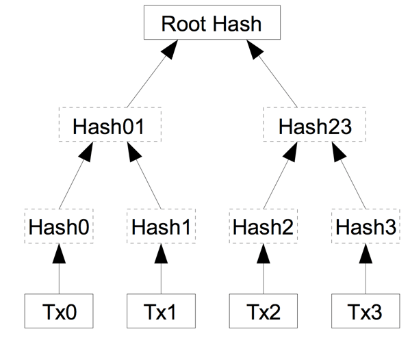

# Merkle tree in Rust

Merkle tree is a data structure composed of hashes. The ends of the tree (the leaves) are hashed together in pairs. If the number of sheets is odd, then we hash with a copy of itself.  
At the end we obtain the root hash, which allows to check the integrity of all the data of the tree since if a single transaction changes, the root hash also changes  

<div style="text-align:center">

</div>

## Transaction 

The leaves of the tree are represented by transactions that are composed with the following information: 
```rust
pub struct Tx{
    amount : u64,
    sender : String,
    receiver : String,
}
```
In order for the transaction to be hashed , it's converted into a string of characters of this format : 
```
amount:sender:receiver
```

## Run it 

Add transactions in the main.rs file

```rust
    let  txs: Vec<Tx> = vec![Tx::new(1, "Bob".to_owned(), "Alice".to_owned()), 
                            Tx::new(1, "Alice".to_owned(), "Bob".to_owned()),
                            Tx::new(1, "Alice".to_owned(), "Boby".to_owned()),
                            Tx::new(1, "Alice".to_owned(), "Boby".to_owned()),
                            Tx::new(1, "Jacques".to_owned(), "Boby".to_owned()),
                           ];
```
You need cargo to be able to run the command (install <a href="https://doc.rust-lang.org/cargo/getting-started/installation.html">here</a>)

```bash
cargo run 
```